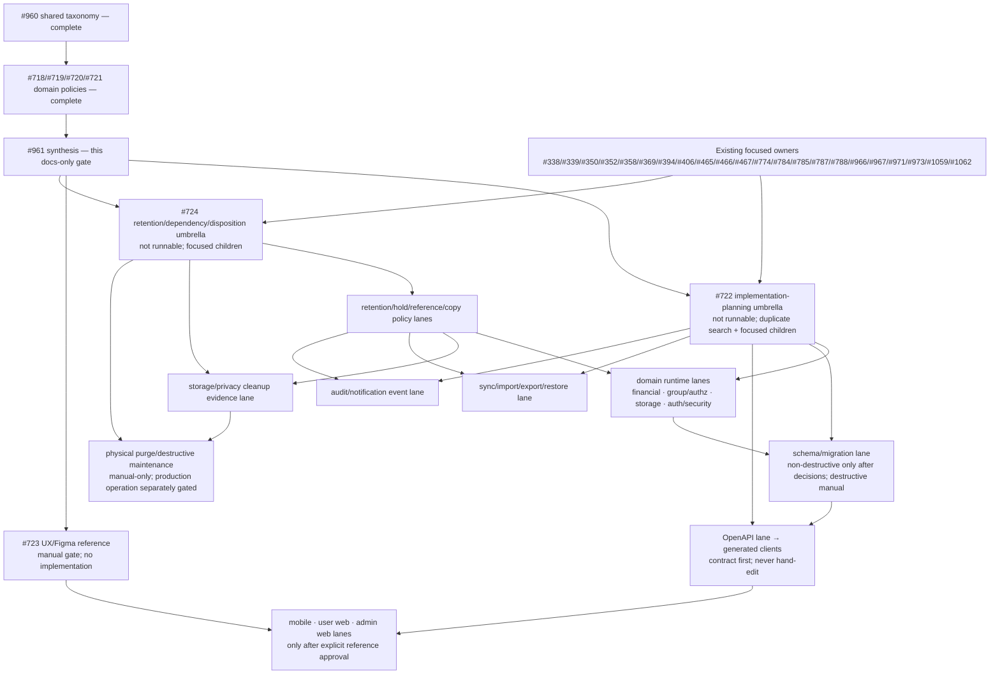

# Day 1 Lifecycle Policy Matrix And Implementation Handoff

Issue: [#961](https://github.com/tommytang213/Settleora/issues/961)

Parent chain: [#716](https://github.com/tommytang213/Settleora/issues/716) →
[#717](https://github.com/tommytang213/Settleora/issues/717) → #961. Shared
taxonomy: [#960](https://github.com/tommytang213/Settleora/issues/960).

## 1. Status, Authority, And Safe Use

This document is the authoritative cross-domain **planning index** for the
four merged Day 1 lifecycle policies. The child documents remain authoritative
for their rows, choices, gates, current-fact classifications, and domain
owners. This synthesis groups those facts for dependency planning; it does not
rewrite them or turn a range reference into a new policy decision.

The candidate was derived from `origin/main` at
`356485ab79814572bf05f10ac8190477b949253d` (tree
`376899b68217bc71a9fd69a198724c2ea7e1c26d`). The evidence labels have their
shared #960 meanings:

- **implemented current fact** describes source/test/runtime evidence, even
  when the child records a defect or incomplete safety boundary;
- **documented accepted requirement** is merged intended policy but is not
  necessarily implemented;
- **future acceptance requirement** is a condition later focused work must
  prove and is not implementation authorization; and
- **unresolved choice** stays blocked under its child owner and gate. This
  matrix selects none of those choices.

Canonical authority remains separated:

- API/domain services own server business mutation acceptance,
  authorization, money and status truth, audit, sync acceptance, and
  restore/import acceptance. Workers do not directly mutate core tables.
- Financial calculation, currency, rounding, split, revision, settlement,
  payment, allocation, and residual truth stays with #718 and its money lane.
- File-object, subject-link, byte, provider, copy, and retention mechanics stay
  with #719 and its storage/privacy lane.
- Group membership, future participation, historical participant identity,
  and record-specific access stay with #720 and its group/authz owners.
- Credential, session/family, factor, account, identity, role, challenge,
  security-policy, and auth-audit lifecycle stays with #721 and its
  auth/security owners.
- OpenAPI is contract authority; generated clients are regenerated and never
  hand-edited. Clients never decide authorization or financial truth.
- Physical purge, destructive migration, file-byte disposal, and production
  maintenance remain separate manual-only operations.

## 2. Authority And Source Map

Counts below come from the final merged files, not PR descriptions.

| Issue | Merged source and reviewed blob on this base | Exact merge evidence | Final inventory | Canonical authority / lane | Classification semantics |
| --- | --- | --- | --- | --- | --- |
| #960 | [`DAY1_LIFECYCLE_POLICY_TEMPLATE.md`](DAY1_LIFECYCLE_POLICY_TEMPLATE.md), blob `1d7e11e5e320ee0a8238c43122b1cc1db1da726f` | PR #1237, reviewed head `3cc3330ba2175bb0b66b655918e939364565249c`, merge `a93409c306133ef7b9c4d1861f36f69f724b011e` | Shared vocabulary, reusable row/open-choice schema, child checklists, and synthesis rule | Neutral planning / `docs-planning` | Defines labels and minimum fields only; it owns no domain transition. |
| #718 | [`BILL_SETTLEMENT_RECORD_LIFECYCLE_POLICY.md`](../architecture/BILL_SETTLEMENT_RECORD_LIFECYCLE_POLICY.md), blob `7ca8ec59227110f0e658a7f2edd77fc94ccf2116` | PR #1243, reviewed head `391c99c737fd9141839e57ec283c17fa0577c769`, merge `70d8abf1ffdd247ec3ab2b5816dccc0091dd3ba4`; hygiene PR #1244, merge `097dfc23e2064acc413aba654690b829008e0c34` | **117 rows, 80 open choices, 9 gates** | Financial records / `money-settlement-payment` | Current runtime, accepted money/history requirements, future acceptance, and unresolved money/product choices stay distinct. |
| #719 | [`STORAGE_FILE_LIFECYCLE_POLICY.md`](../architecture/STORAGE_FILE_LIFECYCLE_POLICY.md), blob `4cdcc836d13177bf6f4986b6f37753b6ea0adfce` | PR #1239, reviewed head `e6459a0750cb9c50b4cc662455e4e4efd5e2ddfe`, merge `373148485314e3d8a8b56e8ef331b3f6a58f9d58`; hygiene PR #1242, merge `5d313cb2745b5c9b1239ce1196d1eb883eeba9f5` | **68 rows, 8 open choices, 12 gates** | File objects/links/bytes / `storage-file-privacy-authz` | Object state, link state, provider outcome, client copy, logical removal, and physical disposition never imply one another. |
| #720 | [`GROUP_MEMBERSHIP_LIFECYCLE_POLICY.md`](GROUP_MEMBERSHIP_LIFECYCLE_POLICY.md), blob `5f6596b5d1a543b144fe6ea00629f0259a815a4a` | PR #1245, reviewed head `6d6d6e36c9c662667c8b5fd65b51c270260504d4`, merge `4a6810c4773d5b486d4fd27f9684ecaae1c447a2`; hygiene PR #1246, merge `356485ab79814572bf05f10ac8190477b949253d` | **26 rows, 17 open choices, 11 gates** | Group/membership/historical participation / `docs-planning` until focused group/authz lanes are admitted | Future membership/default/notification eligibility is separate from stable historical identity and record-specific access. |
| #721 | [`AUTH_SECURITY_LIFECYCLE_POLICY.md`](../architecture/AUTH_SECURITY_LIFECYCLE_POLICY.md), blob `3d0a3dfabde26ecbf2d7339f505797125ffe9d8d` | PR #1238, reviewed head `e94cc2005dd29c7dc7e7c666b8f5778080855469`, merge `6981236c786a7914ac1a17c25d9c3d9de22c8b74` | **190 rows, 13 open choices, 11 gates** | Auth/session/security / `auth-session-security` | Loss of usability, revocation, expiry, disablement, evidence retention, and physical removal are separate; reusable secrets are never lifecycle evidence. |

### 2.1 Exact child inventory index

Ranges are inclusive. They are compact provenance pointers, not replacement
definitions.

- **Financial rows (117):** `FIN-BILL-001..021`, `FIN-COMP-001..009`,
  `FIN-CLAIM-001..009`, `FIN-FX-001`, `FIN-PART-001..005`,
  `FIN-REV-001..010`, `FIN-RECON-001..002`, `FIN-SET-001..006`,
  `FIN-LINE-001`, `FIN-PAY-001..004`, `FIN-ALLOC-001`,
  `FIN-RES-001..004`, `FIN-REC-001..016`, `FIN-DER-001..003`,
  `FIN-PROOF-001..003`, `LOCAL-BILL-001..002`, `LOCAL-RECON-001`,
  `LOCAL-REV-001`, `LOCAL-ITEM-001`, `LOCAL-SPLIT-001`,
  `LOCAL-PART-001`, `LOCAL-PAYER-001`, `LOCAL-ADJ-001`, `LOCAL-FX-001`,
  `LOCAL-SET-001`, `LOCAL-LINE-001`, `LOCAL-PAY-001`, `LOCAL-PROOF-001`,
  `LOCAL-ALLOC-001`, `LOCAL-RES-001`, `LOCAL-REC-001`, `LOCAL-OCC-001`,
  `LOCAL-CLAIM-001`, and `LOCAL-DER-001..003`.
- **Storage rows (68):** `FILE-LC-OBJ-001..010`,
  `FILE-LC-LINK-001..013`, `FILE-LC-PKG-001..024`,
  `FILE-LC-CLN-001..009`, and `FILE-LC-LOCAL-001..012`.
- **Membership rows (26):** `GRP-001..004`, `MEM-001..008`,
  `INV-001..005`, `GUEST-001..002`, `HIST-001..002`, `LOCAL-GRP-001`,
  `LOCAL-MEM-001`, `LOCAL-HIST-001`, and `LOCAL-PART-001..002`.
- **Auth/security rows (190):** `AUTH-LC-SES-001..015`,
  `AUTH-LC-REF-001..023`, `AUTH-LC-PWD-001..012`,
  `AUTH-LC-ACC-001..008`, `AUTH-LC-ID-001..009`,
  `AUTH-LC-ROL-001..008`, `AUTH-LC-PKY-001..008`,
  `AUTH-LC-TOTP-001..016`, `AUTH-LC-RCV-001..016`,
  `AUTH-LC-CHL-001..023`, `AUTH-LC-RST-001..014`,
  `AUTH-LC-INV-001..015`, `AUTH-LC-PRO-001..005`,
  `AUTH-LC-ABU-001..010`, `AUTH-LC-POL-001..005`, and
  `AUTH-LC-AUD-001..003`.

Open choices remain exactly `FIN-CHOICE-001..080`,
`FILE-LC-CHOICE-001..008`, `MEM-CHOICE-001..017`, and
`AUTH-LC-CHOICE-001..013`. Gate registries remain exactly:

- #718: `G-MONEY`, `G-PRODUCT`, `G-SCHEMA`, `G-CONTRACT`, `G-CLIENT`,
  `G-RET`, `G-DEST`, `G-PRIV`, `G-SYNC`;
- #719: `FILE-LC-GATE-001..012`;
- #720: `G-PRODUCT`, `G-AUTHZ`, `G-IDENTITY`, `G-MONEY`, `G-SCHEMA`,
  `G-CONTRACT`, `G-CLIENT`, `G-RET`, `G-PRIV`, `G-SYNC`, `G-DEST`; and
- #721: `G-AUTH`, `G-LOCK`, `G-SCHEMA`, `G-CONTRACT`, `G-CLIENT`,
  `G-RET`, `G-PRIV`, `G-DEST`, `G-PROV`, `G-CONFIG`, `G-EXPOSE`.

Same-named gates are domain-owned records, not a single cross-domain approval.
Later packets must cite them as `FIN:<gate>`, `FILE:<gate>`, `MEM:<gate>`, or
`AUTH:<gate>`.

## 3. Consolidated Matrix

The matrix deliberately summarizes families. The source row IDs remain the
complete transition definitions.

| Synthesis ID / authoritative rows | Record or relationship family; current classification | Intended/future lifecycle and user term | Historical/reference and future access/selection effect; reactivation | Retention/disposition, audit/redaction, concurrency | Dependencies, choices, gates, Day scope, canonical future owner |
| --- | --- | --- | --- | --- | --- |
| `SYN-FIN-01` — `FIN-BILL-001..021` | Bill roots across direct, future, import, recurring, personal and group paths. Archive/restore, create, submit, participant accept/reject, future update/post/cancel and narrow OCR apply include implemented facts; general edit/finalize/status-archive/reopen remain partial, unsupported, or unresolved. | Preserve exact child verbs: **Archive bill**, **Restore bill**, **Submit**, **Accept**, **Reject**, **Cancel future bill**, **Edit draft bill**. Archive overlay is not financial status, cancel is not purge, and restore is not reopen/recalculate. | Retain bill identity and accepted money/history. Ordinary lists may exclude archived rows; later restore must revalidate current authorization, revisions, settlements, participants and policy/version. Future selection never follows from historical presence. | Retention clocks and draft-only hard-delete proof are unresolved; ordinary actions never purge accepted history. API audit is required. Most mutations lack a general idempotency key/version guard and must not be retried as assumed new work. | Files #719, membership #720, auth actor #721, sync/import owners. `FIN-CHOICE-001..010`, `025..026`, `029`, `062..072`, `076..080`; financial gates as cited by child. Day 1 where PRD requires create/edit/archive/restore; status activation not inferred. #722 plus existing #967/#352/#350. |
| `SYN-FIN-02` — `FIN-COMP-001..009`, `FIN-CLAIM-001..009`, `FIN-FX-001`, `FIN-PART-001..005` | Items, splits, participants, payers, adjustments, quantity claims, FX snapshot and participant settlement projections. Persistence/current narrow behavior exists, while broad component edit, claim runtime, active-payer actions and participant settlement writers are missing or partial. | Draft-only component removal, reviewed quantity/claim workflow, payer confirmation, and immutable bill-level manual FX are distinct. Client labels never define money state. | Accepted component, claim, payer and FX bases must keep deterministic explainability. Historical participant identity remains stable; future inclusion and current authorization are separately rechecked. | No physical removal without positive dependency proof. Audit/redaction excludes payment details and private source content. Money mutations need expected basis/version, stable operation identity, atomic calculation/audit and conflict outcomes. | #719 OCR/files, #720 participant identity, #723 UX. `FIN-CHOICE-005`, `015..024`, `030..032`, `042..044`, `057`, `062..072`; `FIN:G-MONEY` and conditional schema/contract/client/retention/privacy/destructive gates. Day 1 claims/FX/edit requirements; #350/#352/#967, then #722. |
| `SYN-FIN-03` — `FIN-REV-001..010` | Bill revision proposal, review, approval, payer confirmation, apply, withdraw/resubmit/reject/cancel. Runtime is partial and current rejection authority is broader than its name suggests. | **Propose**, **Submit**, **Approve**, **Apply**, **Withdraw**, **Revise and resubmit**, **Reject** remain distinct. Pending revisions never silently change balances. | Baseline/proposed snapshots, approvals, payer basis, hashes and affected-user evidence must survive; current snapshot/application does not prove complete item/split/adjustment history. Re-entry after rejection/cancel is unresolved. | Retain accepted/rejected/superseded evidence; no ordinary purge. Audit and notifications use bounded metadata. Application and payer actions require immutable basis, concurrency and retry proof. | Settlement dependencies, file/OCR IDs, historical participants. `FIN-CHOICE-003`, `006`, `015..019`, `027..028`, `034`, `042..044`, `057`; money/product/schema/contract/client/retention/privacy gates. Day 1 revision workflow; #967/#722 and #369/#973. |
| `SYN-FIN-04` — `FIN-SET-001..006`, `FIN-LINE-001`, `FIN-PAY-001..004`, `FIN-ALLOC-001`, `FIN-RES-001..004`, `FIN-PROOF-001..003` | Settlement requests/lines, payment claims, allocations, residuals and proof relationships. Request/payment transitions and residual handling have implemented slices; archive/restore/reopen and independent dependent-row lifecycle do not. | **Request payment**, **Cancel request**, **Dispute**, **Mark paid**, **Confirm payment**, and proof **Attach/View/Remove** are distinct. Archive/history presentation cannot change financial effect. | Concrete lines, allocations and residuals retain explanation. Cancellation/dispute changes active effect, not history. Restore/reopen must not revive immutable or superseded money. | Retention remains unresolved; proof bytes/links are #719. Audit avoids payment details/file contents. Current entities generally lack concurrency tokens/idempotency keys, so uncertain outcomes require reconciliation. | Bill/revision basis, membership access, file proof, notification/audit, sync. `FIN-CHOICE-006..010`, `045..047`, `050..051`; money plus storage/retention/privacy/destructive gates. Day 1 settlement flow; #722 plus existing settlement owners and #719/#724. |
| `SYN-FIN-05` — `FIN-REC-001..016`, `FIN-DER-001..003`, `FIN-RECON-001..002` | Recurring templates/occurrences, balance/report/forecast projections and reconciliation dimension. Template lifecycle and explicit draft generation are partly implemented; restore/skip/cancel/reopen and intended group actor rules are unresolved. | **Pause**, **Resume**, **Archive recurring bill**, **Generate draft**, **View forecast/report/balance**, and reconciliation actions are not interchangeable. Generated bills become independent bill roots. | Template changes never rewrite generated bills. Derived views never become financial truth; omitted archived sources must be disclosed. Reactivation and occurrence re-entry require fresh schedule, actor and dependency checks. | Retain source lineage and calculation/policy identity. Forecast read side effects do not grant lifecycle authority. Concurrency/idempotency gaps remain for template creation/update and occurrence actions. | Membership actor, notifications, local/sync state. `FIN-CHOICE-009`, `011..014`, `033`, `035..041`, `048`, `052..053`, `058..061`; financial/product/sync/client gates. Day 1 basic recurrence/reports/reconciliation; #722/#724 and existing recurring/notification owners. |
| `SYN-FIN-06` — all `LOCAL-*` financial rows | Locally authoritative bills/components/settlements/recurrence/claims and cached derived outputs. The authority boundary is accepted; exact local financial lifecycle engine is unimplemented. | Future local archive/restore and record changes must use explicit local states. Server import is a new server acceptance, never silent merge or history rewrite. | Local history remains authoritative locally until explicit migration. Cached projections remain derived. Future server selection/access follows server authorization after acceptance only. | Local clocks, holds, hard-delete and purge eligibility are unresolved. Encrypted backup/copy handling and operation identity are required. | `FIN-CHOICE-013`, `048..056`, `073..075`; sync/privacy/money/retention/destructive gates. Day 1 local/offline boundary; #724 plus #406/#971 and later focused local/mobile owners. |
| `SYN-FILE-01` — `FILE-LC-OBJ-001..010` | Provider-neutral object reservation, activation/failure, quarantine/release/reject, logical deletion, restore, metadata `purged`, and future physical purge. Current runtime is partial and records unknown/unsafe outcomes. | **Added**, **Quarantine**, **Release**, **Move to Trash**, **Restore**, and **Purge** are distinct. Current metadata `purged` must never be called physically or permanently deleted. | Object state never activates a link or grants access. Restore requires all active links to be enumerated and accepted; inactive links remain inactive. | Provider outcome, bytes, metadata tombstone and copies are separate. Audit/redaction hides object keys, paths, URLs, vault material and contents. Reservation/write/compensation/reload gaps require durable operation identity and reconciliation. | Link/reference registry, auth actor, domain histories. `FILE-LC-CHOICE-001..004`, `008`; `FILE:FILE-LC-GATE-001..010` as applicable. Day 1 logical removal/restore; physical purge manual-only. #966/#722/#724. |
| `SYN-FILE-02` — `FILE-LC-LINK-001..013` | Receipt/supporting, settlement-proof and payment-QR subject links. Attach/remove/replace have current slices; restore/reattach are proposed. Current remove can mark a shared object deleted without reference proof. | **Attach/Add**, **Remove**, **Replace**, **Restore/Reattach** operate on relationships; they do not prove object disposal. | Historical bill/payment/OCR/revision references remain. Inactive link blocks ordinary read; object activation alone grants nothing. Restore is purpose-, subject-, actor- and state-specific. | Multi-link dependency proof blocks disposal. Audit excludes bytes/provider internals/payment details. Stale authorization/status checks, missing-response retries and last-write-wins require acceptance-time checks and idempotency/versioning. | #718 financial references, #720 access, #721 actor state. `FILE-LC-CHOICE-001..004`; privacy/authz, schema, contract, UX, retention and destructive gates. Day 1 file links; #966/#722/#723/#724. |
| `SYN-FILE-03` — `FILE-LC-PKG-001..024`, `FILE-LC-CLN-001..009` | Backup/export/import sessions/artifacts, provider/server working copies, failed upload/orphan/temporary reconciliation. Current behavior includes process-local/persisted states and incomplete capacity, authz, cleanup, and response truth. | Session **Cancel/Discard/Expire** and cleanup are not file-object purge. Failed, inaccessible, unlinked, expired, or missing is never orphan proof. | Import/restore remains new domain acceptance. Package/session expiry cannot recall browser/device/backup/replica copies. Cleanup cannot sever domain/history references. | Positive consistent-snapshot reference/copy/hold proof, leases and idempotent outcome records are required. Reports redact content, keys, paths, tokens and hidden metadata. | `FILE-LC-CHOICE-001`, `004`, `006`, `008`; #406/#971, #724, #966; storage/privacy/schema/API/sync/money/provider/destructive gates. Day 1 import/export/backup safety; physical cleanup manual-only. |
| `SYN-FILE-04` — `FILE-LC-LOCAL-001..012` | Mobile/web scratch, normalized receipt/thumbnail, local backup JSON, downloads, browser files/Blobs/URLs and selected attachment/import copies. These are client-local copies, never server authority. | **Discard temporary copy** applies only to a positively identified local copy under platform policy; it cannot imply server deletion or authoritative history loss. | Account ownership and source identity must bind queued/offline/downloaded material. Server lifecycle cannot recall external copies. | Secure storage, capacity/decode/depth limits, clocks and erasure evidence are unresolved. Never log paths/content. Async results require request-generation identity. | `FILE-LC-CHOICE-005..007`; local platform/privacy, sync, storage and UX gates. Day 1 local/offline/capture safety; #358/#406/#971/#966/#724. |
| `SYN-MEM-01` — `GRP-001..004`, `MEM-001..008`, `INV-001..005` | Group root, membership roles/statuses/default selection and group invitations. Create/rename/add/remove/change-role have current slices; archive, reactivation, default exclusion, leave/rejoin and invitation lifecycle are partial or unresolved. | **Archive group**, **Reactivate group**, **Exclude/Include in defaults**, **Leave**, **Remove**, **Rejoin/Restore**, and invitation actions are distinct. | Current/future membership, future defaults and notification eligibility are separate from record-specific historical access. Re-entry never silently restores old role/access or reopens records. | Membership/invitation history and owner continuity need retention/audit. Query-time authorization is not acceptance-time concurrency proof. | `MEM-CHOICE-001..007`, `011`, `013..016`; group/authz/identity/product/schema/contract/client/retention gates. **Mixed scope:** Day 1 group root, role, removal and invitation requirements; `MEM-003..006` default exclusion/inclusion and leave/rejoin remain **Day 2/later**. #722/#723/#724 plus existing invitation/auth/group owners. |
| `SYN-MEM-02` — `GUEST-001..002`, `HIST-001..002`, `LOCAL-GRP-001`, `LOCAL-MEM-001`, `LOCAL-HIST-001`, `LOCAL-PART-001..002` | Temporary participants, historical bill/settlement identities, and local-only person references. Stable history is accepted; exact guest claim/link and local representation remain unresolved. | Historical identity is **not independently removable**. Later **Claim/link account** is not membership creation and must not rewrite prior participant/payer/split/settlement facts. | History-specific authorization may survive membership loss only where the record policy permits; it grants no unrelated future access. Local/server transition is explicit new acceptance. | Retain provenance, consent and conflict evidence; minimize contact/private data. No hard delete/purge without all financial, file, sync, audit and copy dependencies. | `MEM-CHOICE-008..010`, `012`, `015`, `017`; identity/privacy/authz/money/sync/retention/destructive gates. Day 1 stable temporary references; fuller guest governance later-day. #722/#724 and existing temporary-participant/account-link owners. |
| `SYN-AUTH-01` — `AUTH-LC-SES-001..015`, `AUTH-LC-REF-001..023`, `AUTH-LC-PWD-001..012` | Access sessions, refresh families/credentials and local passwords. Many sign-in/refresh/revoke/change/reset slices are implemented but expiry materialization, cascade completeness, failure atomicity and shared-family handling remain partial. | **Sign out**, **Revoke**, **Expire**, **Rotate/replace**, **Change password**, **Reset password**, **Disable/Re-enable credential** remain distinct. | Revocation/loss of usability does not remove retained security evidence. Re-entry needs current account, credential, factor, policy and lockout checks; predecessor reusable material is never retained as evidence. | Bounded hashes/tombstones only where approved; never raw password/token/reset material. Audit result must match persisted state. Rotation/replay/concurrency and uncertain saves need explicit lineage/idempotency outcomes. | `AUTH-LC-CHOICE-002`, `007`, `010`, `012..013`; auth/lockout/schema/contract/client/retention/privacy/destructive/provider gates. Day 1 auth/session; #338/#339/#1059/#724. |
| `SYN-AUTH-02` — `AUTH-LC-ACC-001..008`, `AUTH-LC-ID-001..009`, `AUTH-LC-ROL-001..008`, `AUTH-LC-PRO-001..005` | Accounts, profiles, identity links and product roles across bootstrap, invitation and admin provisioning. Creation paths exist; general disable/re-enable/delete/link/unlink/role mutation and rollback/recovery are incomplete. | **Disable account**, **Re-enable**, **Delete account**, **Link/Unlink identity**, **Assign/Change/Remove role** are separate. Account deletion is not profile/domain-data purge. | Last-owner, remaining sign-in method, sessions/factors, group ownership, financial history, files and audit block cascades. Re-link/re-enable never silently recreates old role/access. | Retain minimum correlation/tombstone evidence; no reusable secret/provider token. Creation compensation is not general deletion authority. Versioned atomic bundle/concurrency proof is required. | #718/#719/#720 dependencies; `AUTH-LC-CHOICE-001`, `003..004`; auth/lockout/privacy/schema/contract/client/retention/destructive/exposure gates. Day 1 account/admin security; #785/#787/#788/#724. |
| `SYN-AUTH-03` — `AUTH-LC-PKY-001..008`, `AUTH-LC-TOTP-001..016`, `AUTH-LC-RCV-001..016`, `AUTH-LC-CHL-001..023` | Passkeys, TOTP, recovery codes and challenges. Runtime foundations are partial; corruption, algorithm metadata, replay, binding, healthy-sibling behavior and material lifecycle have unresolved acceptance. | **Finish setup**, **Disable/Re-enable/Revoke**, **Replace recovery codes**, challenge **Verify/Consume/Expire/Block/Fail/Cancel** are distinct. | Disabling a factor does not remove account or evidence. Re-enable/use requires current policy and anti-lockout checks. Challenge terminal state never reactivates a credential. | Raw seed, private passkey material, displayed recovery codes and reusable ceremony material are never retained/audited. Terminal evidence is bounded; secret lifetime/zeroization and concurrent exact consumption require proof. | `AUTH-LC-CHOICE-005..006`, `012`; auth/lockout/schema/contract/client/retention/privacy/destructive/config gates. Day 1 MFA/passkeys; #394/#465/#775/#776 and #965 recommendations. |
| `SYN-AUTH-04` — `AUTH-LC-RST-001..014`, `AUTH-LC-INV-001..015`, `AUTH-LC-ABU-001..010`, `AUTH-LC-POL-001..005`, `AUTH-LC-AUD-001..003` | Reset/invitation one-time material, abuse state, security policy and auth audit. Implemented slices include contradictions in delivery/save truth, expiry cleanup, policy replacement, actor/correlation and retention. | **Request/issue/reset**, **Invite/accept/resend/revoke/expire**, policy **Draft/Activate/Retire**, and audit **Retain** remain separate. Expiry is not purge. | Terminal one-time material grants no account re-entry; account/membership creation is separately accepted. Audit survives ordinary user action subject to redaction and approved retention. | Raw links/tokens are excluded. Retention clocks/holds, cleanup authority and failed-operation evidence are unresolved. Delivery and final-save outcomes need reconciled idempotency/audit truth. | `AUTH-LC-CHOICE-007..009`, `011..012`; auth/provider/config/exposure/privacy/retention/destructive gates. Day 1 reset/invitation/security policy; #339/#724/#774/#784/#973. |

## 4. Cross-Domain Contradiction And Gap Register

Every child open-choice ID appears below. “Safe posture” means no new
acceptance is inferred; current runtime may still require a focused defect fix.

| Gap ID | Exact sources / choices | Conflict or undecided overlap; why it cannot be normalized | Current safe posture | Owner, dependency, gate, Day scope and next lane |
| --- | --- | --- | --- | --- |
| `GAP-01` | `FIN-BILL-001..002`, `FIN-CHOICE-001..010`, `FIN-CHOICE-025`, `FIN-CHOICE-026`; `FILE-LC-OBJ-006..009`, `FILE-LC-CHOICE-001..004/008`; `MEM-CHOICE-001/006/009`; `AUTH-LC-CHOICE-001/009` | “Restore,” dependency-free draft disposal, retention expiry and purge refer to different roots and evidence. The unaccepted bill `finalized` and status `archived` activations cannot be treated as the archive overlay. Bill history, file bytes/link state, membership access, account state and audit cannot share one boolean. | Archive/logically remove only under current accepted rules; do not activate the unsupported bill states; block physical disposition and any restore lacking current domain revalidation. | #724 after this matrix, then #722; financial product/status plus all domain retention/privacy/money/authz gates. Day 1 policy, destructive execution manual-only. |
| `GAP-02` | `FIN-PROOF-001..003`, `FIN-REV-001..010`; `FILE-LC-LINK-001..013`, `FILE-LC-CHOICE-002/004` | Financial/revision/OCR history can retain file IDs while current link removal can mark a shared object deleted. An ID, removed link, or unreadable object does not decide whether bytes or tombstone must remain. | Preserve references and fail closed; do not dispose or reactivate object/link by implication. | #719/#718 owners via #966/#724, then storage and money slices under #722; privacy/storage/money/destructive gates. Day 1. |
| `GAP-03` | `FIN-COMP-003..004`, `FIN-CHOICE-042..044/057`; `HIST-001..002`, `MEM-CHOICE-006/008/015`; file/OCR snapshot references | Current revision apply can mutate participant rows and replace/remove active payer rows while historical-person policy forbids rewriting identity and snapshots do not prove full component history. | Retain every available snapshot/reference; accept no broader edit/apply history claim until the financial history contract is approved. | Existing #967 with #720/#719, #722 schema/domain split; money/authz/identity/schema/retention gates. Day 1. |
| `GAP-04` | `FIN-CHOICE-011..014/029/033/035..041/058..061`; `MEM-CHOICE-001..007/011/013..016` | Group membership loss, default exclusion, group archive and recurring actor/owner rules affect future generation, but cannot rewrite generated bills or grant historical access. | Preserve current bounded behavior; do not add restore/re-entry or broaden actor authority. | Financial/group owners via #722; #723 for wording; money/authz/product/client gates. Day 1 recurrence; richer governance later-day. |
| `GAP-05` | `FIN-CHOICE-015..024/027..028/030..034/042..047/057`; `MEM-CHOICE-006/015`; `FILE-LC-CHOICE-004` | Payer confirmation/rejection, revision rejection/cancel, participant settlement statuses and settlement reopen need immutable financial basis plus current participant/file dependencies. Similar “reject/cancel/reopen” words do not share consequences. | Keep current transitions only; block missing actions and re-entry. | #718 owners, existing #967, then #722; financial/product/schema/contract gates. Day 1 where PRD requires confirmation/revision, otherwise unresolved. |
| `GAP-06` | `FIN-CHOICE-048..056/073..075`; `MEM-CHOICE-012/017`; `FILE-LC-CHOICE-006..007` | Local authority, queued copies and server import have different owners. A local archive/delete or successful upload does not prove server acceptance or local-copy disposal. | Preserve local records/copies and pending edits; require explicit user-approved, idempotent new server acceptance and conflict handling. | #406/#971, #724, later #722 contract/domain splits; sync/privacy/money/storage/destructive gates. Day 1 local/offline/import. |
| `GAP-07` | `FIN-CHOICE-062..072/076..080`; `MEM-CHOICE-006/011/014..015`; `AUTH-LC-CHOICE-001/004` | General bill edit and delegated responsible-owner selection require group/account/role availability, but current creator/owner identities and query-time checks do not supply atomic selection, acceptance, history, version or retry semantics. | No inferred delegated owner or general edit mutation. | Existing #967 with group/auth owners, then #722/#723; money/authz/lockout/schema/contract/client gates. Day 1. |
| `GAP-08` | `FILE-LC-CHOICE-001..004/008`; all children’s retention gates | No child defines cross-domain durations, clock triggers, holds, copy inventory, tombstone minimums or terminal proof. Retention expiry is evidence, not authority. | Retain authoritative evidence and block cleanup/disposition. | #724 produces policy and focused children; human trust/privacy/destructive decisions where required. Day 1 policy; execution separately gated. |
| `GAP-09` | `FILE-LC-CHOICE-005..007`; `FIN-CHOICE-054..056`; `MEM-CHOICE-012/017` | Derivatives, browser/device copies, package artifacts and local participant data lack a common ownership/clock/capacity/disposition model. Server state cannot erase external copies. | Treat every copy as independently retained until platform-specific proof; bind actor/account/request generation and redact paths/content. | #358/#406/#971/#966/#724; local platform/storage/privacy/sync gates. Day 1 safety; provider tiering later-day. |
| `GAP-10` | `MEM-CHOICE-001..007/011/013..016`; `AUTH-LC-CHOICE-001/004`; financial group rows | Group/account disablement, membership/role loss, last-owner continuity, invitations and record-specific historical reads overlap but are separate authorization domains. Cascade or re-enable could lock out owners or overgrant history. | No cascade, re-entry, role restoration or historical access inference. Current record-specific API authorization remains authoritative. | Group/auth owners via #722; #723 wording; authz/identity/lockout/privacy/money gates. Day 1. |
| `GAP-11` | `MEM-CHOICE-008..010/017`; `AUTH-LC-CHOICE-001/003`; financial participant rows | Temporary participant claim/link and local person identity must preserve old references without granting membership/account roles or rewriting payer/split/settlement identities. | Preserve stable placeholder/provenance; block claim/link runtime until proof, consent, conflict and access semantics are approved. | Existing temporary-participant/account-link owners with #722/#723/#724; identity/privacy/authz/money gates. Stable reference is Day 1; fuller guest governance later-day. |
| `GAP-12` | `AUTH-LC-CHOICE-001..004/013`; group owner/member rows; financial/file actor checks | Account/credential/identity/role disablement and session revocation have different lockout and cascade effects. “Delete account” cannot mean domain/profile/history/file purge. | Preserve current bounded actions; no new account delete/cascade/general role/identity mutation. | #338/#339/#785/#787/#788/#724, then focused #722 surfaces; auth/lockout/privacy/schema/destructive gates. Day 1 security. |
| `GAP-13` | `AUTH-LC-CHOICE-005..008/010..013`; file secret/copy boundaries | Factor/challenge/reset/invitation material has one-time or reusable-secret rules, while retained audit/tombstone evidence must exclude that material. Delivery, failed save, replay and cleanup outcomes are not equivalent. | Retain bounded non-secret evidence; expose no broader mutation/cleanup and promise no universal invalidation beyond proved runtime. | Auth owners named in #721; #724 retention; later contract/client packets. Auth/security/provider/config/privacy/destructive gates. Day 1. |
| `GAP-14` | `AUTH-LC-CHOICE-009`; financial/group/storage audit requirements; #369/#973/#774 | Domains require audit and retained notification/history dependencies, but no common retention/read/export/disposal rule exists; missing audit cannot be replaced by a notification or planning row. | Emit/retain only source-owned bounded events; block disposition when required evidence is absent; never reconstruct authority client-side. | #724 plus #369/#973/#774 and each domain owner; privacy/retention/auth/money/storage gates. Day 1. |
| `GAP-15` | `AUTH-LC-CHOICE-011`; `FILE-LC-CHOICE-001/006`; all policy/config references | General security, invitation, storage, retention and money policies have different version/effective-time/cascade requirements. A shared “policy” label cannot define runtime application or retroactivity. | Use only current proved defaults/reads; no new activation/replacement or retroactive rewrite. | Domain policy owners, then #722 schema/contract/runtime splits and #724 retention; security/storage/money/manual gates. Day 1. |
| `GAP-16` | `FIN-DER-001..003`, `FIN-CHOICE-009/053`; membership/file/auth inactive-read rows | Current projections and lists can omit archived/inactive roots, but omission is presentation, not deletion or loss of financial/historical authority. | Label omissions; reconstruct from authorized retained sources; fail closed on inconsistent coverage. | Financial read owners plus #722/#723; money/authz/privacy/client gates. Day 1. |

### 4.1 Open-choice semantic preservation index

The gap table groups cross-domain overlaps. This index is part of that register:
it preserves the distinct decision carried by every child choice instead of
treating numeric occurrence as semantic coverage. “Block” means preserve the
child safe posture and make no new transition, authority, disposal, or
acceptance claim.

| Exact child choice(s) | Distinct unresolved decision preserved | Safe posture | Owner, qualified gates and Day scope |
| --- | --- | --- | --- |
| `FIN-CHOICE-001` | Bill restore dependency set and revalidation. | Block restore beyond proved archive-overlay behavior. | #718/#722/#724; `FIN:G-PRODUCT/G-MONEY/G-RET/G-PRIV`; Day 1 restore policy. |
| `FIN-CHOICE-002` | Dependency-free draft disposition is separate from retention/admin purge. | No hard delete or purge without positive proof. | #718/#724; `FIN:G-MONEY/G-RET/G-DEST/G-PRIV`; destructive execution manual-only. |
| `FIN-CHOICE-003..006` | Revision-root/downstream settlement meaning, rejected-bill acknowledgement effect, item-tombstone reactivation, and accepted-revision settlement/payment dependency authority are four separate choices. | Preserve history; no implied root rewrite, tombstone revival, or downstream reopening. | #718/#722/#724; `FIN:G-PRODUCT/G-MONEY/G-RET/G-PRIV`; Day 1 revision safety. |
| `FIN-CHOICE-007` | Whether settlement/payment rejection is a distinct action, never an alias for dispute or cancel. | Expose no rejection action until its actor, target state and evidence are approved. | Settlement owner via #722/#723; `FIN:G-PRODUCT/G-MONEY/G-CONTRACT/G-CLIENT`; Day 1 only if separately accepted. |
| `FIN-CHOICE-008..010` | Settlement-request archive presentation, derived-read archive filters, and all-family retention/copy policy remain independent. | Omission is not deletion; retain and block disposition. | #718/#724; `FIN:G-MONEY/G-RET/G-PRIV/G-DEST`; Day 1 policy. |
| `FIN-CHOICE-011..012` | Recurring-template update actor and occurrence-skip availability. | Preserve current bounded behavior; add neither authority nor skip. | Recurring owner via #722/#723; `FIN:G-PRODUCT/G-MONEY/G-CLIENT`; Day 1 recurrence. |
| `FIN-CHOICE-013` | Exact local-only bill-root lifecycle. | Local authority remains unimplemented; do not borrow server states. | Local/mobile money owner; `FIN:G-PRODUCT/G-MONEY/G-PRIV/G-SYNC`; Day 1 local boundary. |
| `FIN-CHOICE-014` | Group occurrence and generated-bill ownership. | Generated bills keep current proved owner facts; no inferred reassignment. | Recurring/group owners; `FIN:G-PRODUCT/G-MONEY`, `MEM:G-AUTHZ`; Day 1. |
| `FIN-CHOICE-015..024` | Revision payer-confirm/reject availability, actor, root effect, correction and immutable basis; active-payer confirm/reject actor/effect/re-entry/basis; participant settlement-status authority. | Keep only proved transitions; never overwrite confirmation or invent participant status writers. | #718/#967/#722; `FIN:G-PRODUCT/G-MONEY/G-RET/G-SCHEMA/G-CONTRACT/G-CLIENT`; Day 1 where PRD requires. |
| `FIN-CHOICE-025..026` | Activation of bill `finalized` and status `archived`, distinct from the archive overlay. | Do not activate unsupported statuses. | Bill product/money owner; `FIN:G-PRODUCT/G-MONEY/G-SCHEMA/G-CONTRACT/G-CLIENT`; unresolved Day 1 status choice. |
| `FIN-CHOICE-027..034` | Revision reject actor/cancel availability/cancel actor, cancelled-future recovery, active-payer reject actor/correction/basis, and archived-template restore target. | No broader reject/cancel/recovery/restore action. | #718/#722/#723; `FIN:G-PRODUCT/G-MONEY/G-RET/G-CONTRACT/G-CLIENT`; Day 1 only where accepted. |
| `FIN-CHOICE-035..041` | Recurring skip/cancel actor, schedule effect and re-entry for each terminal occurrence state. | No skip/cancel/re-entry beyond proved runtime. | Recurring owner; `FIN:G-PRODUCT/G-MONEY/G-CLIENT`; later capability unless Day 1 separately accepted. |
| `FIN-CHOICE-042..044`, `FIN-CHOICE-057` | Component-removal revision threshold, participant/payer historical sufficiency, and complete item/split/adjustment application/history. | Retain all evidence; no expanded apply or history claim. | #967/#722/#724; `FIN:G-MONEY/G-PRODUCT/G-RET/G-PRIV/G-SCHEMA/G-CONTRACT/G-CLIENT`; Day 1 history safety. |
| `FIN-CHOICE-045..047` | Disputed, cancelled and confirmed settlement/payment re-entry each have distinct consequences. | All remain terminal; no reopen or stale-evidence reuse. | Settlement owner; `FIN:G-PRODUCT/G-MONEY`; Day 2 reversal/refund remains separate. |
| `FIN-CHOICE-048..053` | Local reconciliation, bill/component, settlement, payment/proof, recurrence and derived-output authority/persistence models. | Preserve local authority as unimplemented; derived output is not money truth. | Local/mobile money/privacy owners; `FIN:G-PRODUCT/G-MONEY/G-PRIV/G-RET`; Day 1 local boundary. |
| `FIN-CHOICE-054..056` | Local operation identity, conflict preservation and new server acceptance. | Preserve both sides; no replay, silent merge or server-truth claim. | #406/#971/#722; `FIN:G-SYNC/G-MONEY/G-PRIV/G-CONTRACT/G-CLIENT`; Day 1 sync/import. |
| `FIN-CHOICE-058..061` | Group recurring pause, resume, archive and generation actor authority. | Preserve current actors only as fact; do not broaden or tighten by inference. | Recurring/group owners; `FIN:G-PRODUCT/G-MONEY/G-CLIENT`, `MEM:G-AUTHZ`; Day 1 recurrence. |
| `FIN-CHOICE-062..072` | Ordinary edit eligibility/actor/shape/recalculation/acknowledgement/payer reconfirmation/history/version/idempotency. | No general edit acceptance outside proved narrow paths. | #345/#967/#722/#723; `FIN:G-PRODUCT/G-MONEY/G-RET/G-PRIV/G-SCHEMA/G-CONTRACT/G-CLIENT`; Day 1 edit requirement. |
| `FIN-CHOICE-073..075` | Local retention clocks/holds, hard-delete eligibility and terminal purge eligibility. | Retain; no local hard delete or purge. | #724/local owners; `FIN:G-RET/G-DEST/G-PRIV/G-MONEY`; destructive execution manual-only. |
| `FIN-CHOICE-076..080` | Responsible-owner selector, acceptance, retained history, version/conflict and idempotency. | No delegated selector/owner mutation or history overwrite. | #967/#720/#722/#723/#724; `FIN:G-PRODUCT/G-MONEY/G-RET/G-PRIV/G-SCHEMA/G-CONTRACT/G-CLIENT`; Day 1 role distinction. |
| `FILE-LC-CHOICE-001` | Per-purpose retention duration, clock, hold and tombstone rule. | No automatic expiry or purge. | #724; `FILE:FILE-LC-GATE-005/006`; Day 1 policy. |
| `FILE-LC-CHOICE-002` | Object restore actor/mechanics and separate link reactivation/conflicts. | No restore or silent reattachment. | #722/#723 + subject owners; `FILE:FILE-LC-GATE-002/003/004`; Day 1 logical restore. |
| `FILE-LC-CHOICE-003` | Quarantine entry, inspection, release/reject authority, persisted reasons and target outcomes. | Block ordinary access; unavailable scanner is not clean; no generic delete-as-reject. | #1062/#966; `FILE:FILE-LC-GATE-001/006/007/008`; Day 1 security policy. |
| `FILE-LC-CHOICE-004` | Complete reference/copy registry, lease, snapshot and idempotency proof for orphan/failed cleanup. | Unknown evidence blocks cleanup. | #724/#966 + domain/OCR owners; `FILE:FILE-LC-GATE-001/002/003/005/006/007/010`; Day 1 readiness. |
| `FILE-LC-CHOICE-005` | Derivative identity/linkage, reproducibility and decode/copy bounds. | No independent cleanup or unsafe preview. | #1062/#966/#358/#971; `FILE:FILE-LC-GATE-001/002/003/006/008`; Day 1 safety. |
| `FILE-LC-CHOICE-006` | Import/export/backup/package authority, integrity, capacity, clocks, encryption and copy disposition. | Expiry/discard never proves copy cleanup; block stale/ambiguous acceptance. | #406/#971/#724/#966; `FILE:FILE-LC-GATE-001/002/003/005/006/008/011/012`; Day 1 import/export/restore. |
| `FILE-LC-CHOICE-007` | Per-platform local scratch/cache/offline/download ownership, bounds, clocks and acknowledgement. | Client material is not server authority; retain until platform proof. | #971/#358/#406/#966/#724; `FILE:FILE-LC-GATE-005/006/008/011`; Day 1 client safety. |
| `FILE-LC-CHOICE-008` | Meaning of metadata `purged`, provider disposition and retained tombstone fields. | Treat it only as incomplete metadata marker, never byte deletion/minimization proof. | #724 then #722; `FILE:FILE-LC-GATE-002/003/005/006/007`; destructive execution manual-only. |
| `MEM-CHOICE-001..002` | Group archive representation/exceptions and archive/reactivate actor. | Expose neither transition; do not accept current exceptions as policy. | #722/#723; `MEM:G-PRODUCT/G-AUTHZ/G-PRIV/G-SCHEMA/G-CONTRACT/G-CLIENT`; Day 1 archive planning. |
| `MEM-CHOICE-003..004` | Default exclusion/inclusion authority and leave/re-entry relationship semantics. | No transition; current Day 1 membership remains unchanged. | Later product/authz lane; `MEM:G-PRODUCT/G-AUTHZ/G-SCHEMA/G-CONTRACT/G-CLIENT`; **Day 2/later**. |
| `MEM-CHOICE-005` | Removed-membership tombstone/reactivation actor and in-place-versus-new relationship. | Removed remains removed. | #722/#724; `MEM:G-PRODUCT/G-AUTHZ/G-RET/G-SCHEMA/G-CONTRACT/G-CLIENT`; Day 1 removal, reactivation unresolved. |
| `MEM-CHOICE-006..007` | Record-specific historical/current access and notification eligibility after membership lifecycle changes. | Do not infer blanket access or recipient eligibility. | Group/financial/sync/notification owners; `MEM:G-AUTHZ/G-PRIV/G-MONEY/G-SYNC/G-PRODUCT`; Day 1. |
| `MEM-CHOICE-008` | Temporary participant claim/link actors, proof, consent, conflicts and access. | Stable reference only; expose no claim/link. | Identity/authz owners; `MEM:G-PRODUCT/G-IDENTITY/G-AUTHZ/G-PRIV/G-SCHEMA/G-CONTRACT/G-CLIENT`; stable Day 1 reference, fuller governance later. |
| `MEM-CHOICE-009` | Group/membership/placeholder/history retention and copies. | Retain; no physical delete/purge. | #724; `MEM:G-RET/G-PRIV/G-DEST`; destructive execution manual-only. |
| `MEM-CHOICE-010` | Exact lifecycle confirmations, blocked states and wording. | No new UI action. | #723/Tommy; `MEM:G-PRODUCT/G-CLIENT`; Day 1 reference, manual/Figma. |
| `MEM-CHOICE-011` | Query/commit actor predicates, operation identity, version, owner floor and race handling. | Earlier authorization or loaded state is not commit-time authority. | #722 + focused domains; `MEM:G-AUTHZ/G-PRIV/G-MONEY/G-SCHEMA/G-CONTRACT`; Day 1 safety. |
| `MEM-CHOICE-012` | Whether local-only mode ever gains groups/memberships. | Unsupported for Day 1; no technical lane. | Tommy/product architecture; `MEM:G-PRODUCT/G-AUTHZ/G-PRIV/G-SYNC`; post-Day-1 scope proposal only. |
| `MEM-CHOICE-013..014` | Group-archive membership cascade and viable-owner continuity across account/membership changes. | Preserve rows; no cascade/reactivation; block owner-stranding transitions. | Group/auth owners; `MEM:G-PRODUCT/G-AUTHZ/G-IDENTITY`; Day 1 safety. |
| `MEM-CHOICE-015` | Temporary actor creation, membership-qualified record saves, dependency-safe removal and transfer/resolution. | No temporary actor/removal exception/transfer; fail closed for future removal design. | Group/import/sync/money/OCR/settlement owners; `MEM:G-PRODUCT/G-AUTHZ/G-MONEY/G-PRIV/G-SYNC/G-SCHEMA/G-CONTRACT/G-CLIENT`; Day 1. |
| `MEM-CHOICE-016` | Group invitation actors, target/role binding, membership acceptance, expiry/delivery/races. | No group-invitation action or inferred membership. | Group/auth/identity/notification owners; `MEM:G-PRODUCT/G-IDENTITY/G-AUTHZ/G-PRIV/G-RET/G-CLIENT/G-SCHEMA/G-CONTRACT`; Day 1 invitation requirement. |
| `MEM-CHOICE-017` | Local person/temporary-participant representation, history, retention and later import/link. | Local reference only; no silent merge/server authority. | Local identity/import owners; `MEM:G-PRODUCT/G-PRIV/G-RET/G-SYNC/G-CLIENT/G-IDENTITY/G-SCHEMA/G-CONTRACT/G-DEST`; Day 1 local reference. |
| `AUTH-LC-CHOICE-001` | Account create/disable/re-enable/delete bundle, owner recovery, evidence and re-entry. | No general delete/cascade/re-entry. | #785/#788/#724; `AUTH:G-AUTH/G-LOCK/G-RET/G-PRIV/G-DEST`; Day 1 account safety. |
| `AUTH-LC-CHOICE-002` | Password credential creation/change/reset/rehash atomicity and session/material effects. | Preserve proved paths only; no universal invalidation claim. | #338/#339; `AUTH:G-AUTH/G-LOCK/G-SCHEMA/G-CONTRACT/G-CLIENT/G-RET`; Day 1. |
| `AUTH-LC-CHOICE-003` | Identity collision, provider proof, link/unlink/relink and remaining-method/session response. | No general link/unlink/relink. | #787; `AUTH:G-AUTH/G-LOCK/G-PRIV/G-PROV/G-SCHEMA/G-CONTRACT/G-CLIENT`; Day 1. |
| `AUTH-LC-CHOICE-004` | Role creation/assignment/change/removal with owner floor, concurrency and audit. | No general role mutation or inferred restoration. | #785/#788; `AUTH:G-AUTH/G-LOCK/G-SCHEMA/G-CONTRACT/G-CLIENT/G-EXPOSE`; Day 1 admin security. |
| `AUTH-LC-CHOICE-005..006` | Factor eligibility/material/corruption/replay and challenge issuance/binding/freshness/attempt/terminal/cleanup semantics. | No broader factor/challenge action; retain bounded non-secret evidence. | #394/#465/#775/#776/#724; `AUTH:G-AUTH/G-LOCK/G-SCHEMA/G-CONTRACT/G-CLIENT/G-RET/G-PRIV/G-DEST/G-CONFIG`; Day 1 MFA/passkey. |
| `AUTH-LC-CHOICE-007` | Reset initiation, issuance/delivery/hash-version truth, password-change invalidation and consume atomicity. | Preserve enumeration resistance; no unsupported recovery/cleanup claim. | #339/#724; `AUTH:G-AUTH/G-LOCK/G-PROV/G-CONFIG/G-EXPOSE/G-RET/G-PRIV/G-DEST`; Day 1 reset. |
| `AUTH-LC-CHOICE-008` | Invitation creation/delivery/grace/accept/revoke/expiry/policy/cleanup authority and disposition. | Preserve current bounded invitation paths; no inferred terminal cleanup. | #784/#724; `AUTH:G-AUTH/G-LOCK/G-PROV/G-CONFIG/G-EXPOSE/G-RET/G-PRIV/G-DEST`; Day 1 invitation. |
| `AUTH-LC-CHOICE-009` | Audit clock/holds/read/export/correlation/disposition and failed-bundle evidence. | Retain bounded non-secret evidence; no disposition. | #724/#774/#973/#784/#785; `AUTH:G-AUTH/G-RET/G-PRIV/G-DEST`; Day 1 audit policy. |
| `AUTH-LC-CHOICE-010` | Session/refresh issuance, binding, rotation/replay/revocation, expiry materialization, audit failure and lineage. | Preserve proved behavior; no complete-family/expiry/cleanup promise. | #338/#1059/#724; `AUTH:G-AUTH/G-LOCK/G-RET/G-PRIV/G-DEST`; Day 1 sessions. |
| `AUTH-LC-CHOICE-011` | Security/invitation policy draft/activate/replace/retire/version/effective-time/retention. | No new activation/replacement or retroactive cascade. | Policy owners/#784/#724; `AUTH:G-AUTH/G-CONFIG/G-SCHEMA/G-CONTRACT/G-RET/G-PRIV`; Day 1 policy. |
| `AUTH-LC-CHOICE-012` | Which responses may carry secret/ceremony/display material and its failed-path/active-use lifetime. | No redisplay; never retain reusable material as evidence. | Factor/reset/invitation owners; `AUTH:G-AUTH/G-PRIV/G-PROV/G-CONFIG/G-RET/G-DEST`; Day 1 secret safety. |
| `AUTH-LC-CHOICE-013` | Account-wide session revocation coverage and shared-family/current-session exclusion. | Do not promise “all sessions” beyond proved selected roots. | #338/#339/#1059; `AUTH:G-AUTH/G-LOCK/G-RET`; Day 1 sessions. |

### 4.2 Exact choice-to-gate parity map

The owner/gate cells above are routing summaries. This parity map is the exact
gate preservation record and overrides no child: each listed gate remains
independent and pending/conditional exactly as described by its child choice.
Choices are grouped only when their complete gate sets are identical. Slash
suffixes inherit the full domain prefix under §6.1's expansion rule.

| Exact choice(s) | Complete domain-qualified gate set |
| --- | --- |
| `FIN-CHOICE-001` | `FIN:G-MONEY/G-PRODUCT/G-RET` |
| `FIN-CHOICE-002` | `FIN:G-DEST/G-MONEY/G-RET` |
| `FIN-CHOICE-003/004/006/007/012/015/016/017/018/021/022/023/025/026/027/028/029/030/031/034/036/038/040/045/046/047` | `FIN:G-MONEY/G-PRODUCT` |
| `FIN-CHOICE-005` | `FIN:G-MONEY/G-PRODUCT/G-RET/G-SCHEMA` |
| `FIN-CHOICE-008` | `FIN:G-CLIENT/G-MONEY/G-PRODUCT/G-RET` |
| `FIN-CHOICE-009/011/033/035/037/039/041/058/059/060/061/064/068/076/077` | `FIN:G-CLIENT/G-MONEY/G-PRODUCT` |
| `FIN-CHOICE-010` | `FIN:G-DEST/G-PRIV/G-RET` |
| `FIN-CHOICE-013/049` | `FIN:G-CLIENT/G-MONEY/G-PRIV/G-PRODUCT/G-SCHEMA` |
| `FIN-CHOICE-014/024/042/063/079` | `FIN:G-CLIENT/G-CONTRACT/G-MONEY/G-PRODUCT/G-SCHEMA` |
| `FIN-CHOICE-019/032` | `FIN:G-CLIENT/G-CONTRACT/G-MONEY/G-PRIV/G-PRODUCT` |
| `FIN-CHOICE-020/062/065/080` | `FIN:G-CLIENT/G-CONTRACT/G-MONEY/G-PRODUCT` |
| `FIN-CHOICE-043/044` | `FIN:G-DEST/G-MONEY/G-PRIV/G-RET/G-SCHEMA` |
| `FIN-CHOICE-048/050/051/052` | `FIN:G-MONEY/G-PRIV/G-PRODUCT` |
| `FIN-CHOICE-053/070/073` | `FIN:G-MONEY/G-PRIV/G-RET` |
| `FIN-CHOICE-054` | `FIN:G-CONTRACT/G-MONEY/G-SYNC` |
| `FIN-CHOICE-055` | `FIN:G-MONEY/G-PRODUCT/G-SYNC` |
| `FIN-CHOICE-056` | `FIN:G-CLIENT/G-CONTRACT/G-MONEY/G-PRIV/G-SCHEMA/G-SYNC` |
| `FIN-CHOICE-057` | `FIN:G-CLIENT/G-CONTRACT/G-MONEY/G-PRIV/G-PRODUCT/G-RET/G-SCHEMA` |
| `FIN-CHOICE-066` | `FIN:G-CONTRACT/G-MONEY/G-RET/G-SCHEMA` |
| `FIN-CHOICE-067` | `FIN:G-CONTRACT/G-MONEY` |
| `FIN-CHOICE-069` | `FIN:G-CLIENT/G-CONTRACT/G-MONEY/G-PRODUCT/G-RET/G-SCHEMA` |
| `FIN-CHOICE-071` | `FIN:G-CLIENT/G-CONTRACT/G-MONEY/G-SCHEMA` |
| `FIN-CHOICE-072` | `FIN:G-CLIENT/G-CONTRACT/G-MONEY` |
| `FIN-CHOICE-074/075` | `FIN:G-DEST/G-MONEY/G-PRIV/G-RET` |
| `FIN-CHOICE-078` | `FIN:G-MONEY/G-PRIV/G-PRODUCT/G-RET` |
| `FILE-LC-CHOICE-001` | `FILE:FILE-LC-GATE-005/006` |
| `FILE-LC-CHOICE-002` | `FILE:FILE-LC-GATE-002/003/004` |
| `FILE-LC-CHOICE-003` | `FILE:FILE-LC-GATE-001/006/007/008` |
| `FILE-LC-CHOICE-004` | `FILE:FILE-LC-GATE-001/002/003/005/006/007/010` |
| `FILE-LC-CHOICE-005` | `FILE:FILE-LC-GATE-001/002/003/006/008` |
| `FILE-LC-CHOICE-006` | `FILE:FILE-LC-GATE-001/002/003/005/006/008/011/012` |
| `FILE-LC-CHOICE-007` | `FILE:FILE-LC-GATE-005/006/008/011` |
| `FILE-LC-CHOICE-008` | `FILE:FILE-LC-GATE-002/003/005/006/007` |
| `MEM-CHOICE-001` | `MEM:G-AUTHZ/G-CLIENT/G-CONTRACT/G-PRIV/G-PRODUCT/G-SCHEMA` |
| `MEM-CHOICE-002/003` | `MEM:G-AUTHZ/G-CLIENT/G-PRODUCT` |
| `MEM-CHOICE-004` | `MEM:G-AUTHZ/G-CLIENT/G-CONTRACT/G-PRODUCT/G-SCHEMA` |
| `MEM-CHOICE-005` | `MEM:G-AUTHZ/G-CLIENT/G-CONTRACT/G-PRODUCT/G-RET/G-SCHEMA` |
| `MEM-CHOICE-006` | `MEM:G-AUTHZ/G-MONEY/G-PRIV/G-SYNC` |
| `MEM-CHOICE-007` | `MEM:G-AUTHZ/G-PRIV/G-PRODUCT` |
| `MEM-CHOICE-008` | `MEM:G-AUTHZ/G-CLIENT/G-CONTRACT/G-IDENTITY/G-PRIV/G-PRODUCT/G-SCHEMA` |
| `MEM-CHOICE-009` | `MEM:G-DEST/G-PRIV/G-RET` |
| `MEM-CHOICE-010` | `MEM:G-CLIENT/G-PRODUCT` |
| `MEM-CHOICE-011` | `MEM:G-AUTHZ/G-CONTRACT/G-MONEY/G-PRIV/G-SCHEMA` |
| `MEM-CHOICE-012` | `MEM:G-AUTHZ/G-PRIV/G-PRODUCT/G-SYNC` |
| `MEM-CHOICE-013` | `MEM:G-AUTHZ/G-PRODUCT` |
| `MEM-CHOICE-014` | `MEM:G-AUTHZ/G-IDENTITY/G-PRODUCT` |
| `MEM-CHOICE-015` | `MEM:G-AUTHZ/G-CLIENT/G-CONTRACT/G-MONEY/G-PRIV/G-PRODUCT/G-SCHEMA/G-SYNC` |
| `MEM-CHOICE-016` | `MEM:G-AUTHZ/G-CLIENT/G-CONTRACT/G-IDENTITY/G-PRIV/G-PRODUCT/G-RET/G-SCHEMA` |
| `MEM-CHOICE-017` | `MEM:G-CLIENT/G-CONTRACT/G-DEST/G-IDENTITY/G-PRIV/G-PRODUCT/G-RET/G-SCHEMA/G-SYNC` |
| `AUTH-LC-CHOICE-001` | `AUTH:G-AUTH/G-LOCK/G-PRIV/G-SCHEMA/G-DEST` |
| `AUTH-LC-CHOICE-002` | `AUTH:G-AUTH/G-LOCK/G-SCHEMA/G-PRIV/G-RET` |
| `AUTH-LC-CHOICE-003` | `AUTH:G-AUTH/G-LOCK/G-PRIV/G-PROV` |
| `AUTH-LC-CHOICE-004` | `AUTH:G-AUTH/G-LOCK/G-SCHEMA/G-CONTRACT/G-CLIENT/G-EXPOSE` |
| `AUTH-LC-CHOICE-005` | `AUTH:G-AUTH/G-LOCK/G-SCHEMA/G-PRIV/G-RET/G-DEST/G-CONFIG` |
| `AUTH-LC-CHOICE-006` | `AUTH:G-AUTH/G-LOCK/G-RET/G-PRIV/G-DEST` |
| `AUTH-LC-CHOICE-007` | `AUTH:G-AUTH/G-LOCK/G-PRIV/G-PROV/G-EXPOSE/G-RET/G-DEST` |
| `AUTH-LC-CHOICE-008` | `AUTH:G-AUTH/G-PRIV/G-PROV/G-EXPOSE/G-RET/G-DEST` |
| `AUTH-LC-CHOICE-009` | `AUTH:G-AUTH/G-PRIV/G-RET/G-DEST` |
| `AUTH-LC-CHOICE-010` | `AUTH:G-AUTH/G-LOCK/G-RET/G-PRIV/G-DEST` |
| `AUTH-LC-CHOICE-011` | `AUTH:G-AUTH/G-LOCK/G-CONFIG/G-SCHEMA/G-CONTRACT/G-RET` |
| `AUTH-LC-CHOICE-012` | `AUTH:G-AUTH/G-PRIV/G-PROV/G-CONFIG/G-RET/G-DEST` |
| `AUTH-LC-CHOICE-013` | `AUTH:G-AUTH/G-LOCK/G-CONTRACT/G-CLIENT/G-RET` |

## 5. Dependency-Safe Graph

Dependency interpretation:

- **Dependency-safe now after #961 merge:** #722 and #724 may run their own
  duplicate search and planning split; #723 may begin only its explicit
  manual/Figma reference workflow. This task starts none of them.
- **Blocked by policy/product decisions:** any packet consuming an unresolved
  choice above. Technical decomposition may be prepared, but mutation cannot
  be accepted until the applicable owner decides it.
- **Manual-gated:** #723 approval; changed money, auth/security, privacy/authz,
  schema, OpenAPI/generated-client, public/admin exposure, provider/config,
  and production operations under their exact gate.
- **Destructive/manual-only:** physical purge, provider byte deletion,
  destructive migration/data action, backup/replica disposition and live
  maintenance execution.
- **Post-Day-1/future:** richer guest governance; strict private vault;
  provider FX automation; provider tiering/multi-target storage; Day 2
  settlement locks/refunds/reversals/governance. Extension points may be
  preserved, but these are not pulled into Day 1.

## 6. Recommended Focused Issue Split

These are packets for #722/#724 to reconcile against live issues. “New only if
absent” is an instruction to search again, not authorization to create a
duplicate. Every packet forbids unrelated runtime, schema, contract, client,
retention and destructive work.

| Packet / proposed title | Canonical lane; source rows/choices | Prerequisites | Allowed / forbidden scope and likely surface | Day scope; validation / reviewer / Figma-manual status | Close evidence / existing owner |
| --- | --- | --- | --- | --- | --- |
| `PKT-01` Reconcile financial lifecycle runtime decisions | `money-settlement-payment`; `SYN-FIN-01..05`, financial choices | #961; each selected money/product choice; #724 where retention affects acceptance | Allowed focused domain service/tests only. Forbid schema, contract, clients, files, destructive work in same branch. | **Day 1** where the PRD requires the transition; `api-money`; `strong_independent`; **Figma: No; manual approval: Yes — money/product semantics** | Exact transition/actor/dependency/concurrency tests and no history rewrite. Reuse #350/#352/#967 and existing settlement/recurring owners; #722 coordinates. |
| `PKT-02` Implement group and membership lifecycle authorization | focused group/authz lane; `SYN-MEM-01..02` | #961; applicable `MEM-CHOICE-*`; account/record dependencies | One actor/transition family per child. Forbid money decisions, account lifecycle, broad UI and physical deletion. | **Day 1** for accepted group/member capability; high-risk authz/API; `strong_independent`; **Figma: No; manual approval: Yes — authz/product semantics** | Hostile actor, stale membership, owner-floor, historical-access and audit proof. New only if #722 search finds no focused owner. |
| `PKT-03` Reconcile storage object/link lifecycle runtime | `storage-file-privacy-authz`; `SYN-FILE-01..02` | #961; #966; applicable file choices; #724 reference policy | Separate object, link and read/authz slices. Forbid byte purge/provider config and domain money mutation. | **Day 1** logical lifecycle; `api-storage`; `strong_independent`; **Figma: No; manual approval: Yes — storage/privacy semantics** | Multi-link, inactive-read, restore, race/replay and redaction evidence. Reuse #341/#966/#1062. |
| `PKT-04` Reconcile auth session/credential lifecycle | `auth-session-security`; `SYN-AUTH-01` | #961; applicable auth choices and lockout decision | Focused session/family/password behavior and tests. Forbid account/domain purge, UI and provider config. | **Day 1** auth/session; `api-security`; `strong_independent`; **Figma: No; manual approval: Yes — auth/security semantics** | Rotation/reuse/expiry/status/audit-fault/concurrency proof. Reuse #338/#339/#1059. |
| `PKT-05` Reconcile account/identity/role lifecycle | `auth-session-security`; `SYN-AUTH-02` | #961; owner/lockout/product decisions; group ownership inventory | Split account, identity and role children. Forbid cascade deletion and domain-history mutation. | **Day 1** account/admin security where accepted; `api-security`; `strong_independent`; **Figma: No; manual approval: Yes — auth/lockout/privacy semantics** | Last-owner, remaining method, rollback/collision, in-flight/next-request auth and audit proof. Reuse #785/#787/#788. |
| `PKT-06` Reconcile factor/challenge/recovery lifecycle | `auth-session-security`; `SYN-AUTH-03` | #961; #965 recommendations; factor choices | Separate passkey, TOTP, recovery and challenge roots. No secret examples/logs or cleanup. | **Day 1** MFA/passkeys; `api-security`; `strong_independent`; **Figma: No; manual approval: Yes — auth/recovery/schema semantics** | Corruption/metadata/replay/binding/secret-lifetime/healthy-sibling evidence. Reuse #394/#465/#775/#776. |
| `PKT-07` Define retention, hold, reference and copy classes | #724 planning lane; all retention choices/gates | Merged #961; fresh duplicate search | Docs/policy only: bounded classes, triggers, holds, positive dependency/copy proof, tombstone minimums. Forbid durations or disposition not approved by owners. | **Day 1 policy/readiness**; `docs-only`; `strong_independent` because cross-domain; **Figma: No; manual approval: Yes — trust/privacy decisions** | Every child choice mapped, no runtime claim, focused children admitted. Reuse #724. |
| `PKT-08` Prove orphan/failed-upload reconciliation | storage maintenance planning then focused storage runtime; `SYN-FILE-03` | Accepted #724 reference/copy policy; #966; provider decision if applicable | Reconciliation/classification and idempotent outcome only. Forbid physical deletion until separate packet. | **Day 1 safety/readiness**; `api-storage` plus provider fault tests; `strong_independent`; **Figma: No; manual approval: Yes — storage/privacy semantics** | Positive registry/snapshot/lease/copy proof and unknown-outcome tests. New only if #724/#966 search finds no owner. |
| `PKT-09` Plan physical purge and destructive maintenance | manual-only operational lane; all child destructive gates | Accepted domain eligibility + #724 + complete dependency/copy/hold proof | Plan/runbook first; later execution separately approved. Forbid ordinary UI delete semantics and worker core-table mutation. | **Separate manual-only operation, not an ordinary Day 1 action**; destructive/production validation class; `strong_independent`; **Figma: No; manual approval: Yes — destructive/production operation** | Target-specific dry-run, authorization, warnings, audit, rollback limits, provider result and backup/replica evidence. No current issue is made runnable here. |
| `PKT-10` Add lifecycle persistence and migration foundations | focused schema/migrations lane | Approved row/choice contract from domain packet; #724 where retention fields apply | One bounded additive schema family per child. Forbid destructive migration and API/UI co-mingling. | **Day 1 only for accepted lifecycle requirements**; migration validation; `strong_independent`; **Figma: No; manual approval: Yes — schema/migration gate** | Forward/backward compatibility, data backfill, rollback/roll-forward, constraint and concurrency proof. #722 must split; new only if absent. |
| `PKT-11` Add lifecycle OpenAPI contracts and regenerate clients | API/OpenAPI then generated-client lane | Approved domain behavior and schema; exact endpoint/error/state design | Contract first, generated outputs only through repository command. Forbid hand edits and UI behavior. | **Day 1 only for accepted lifecycle requirements**; OpenAPI/client generation plus affected API/client validation; `strong_independent`; **Figma: No; manual approval: Yes — API/contract gate** | Spec review, regenerated parity, compatibility and stable error semantics. #722 must split by domain. |
| `PKT-12` Design lifecycle UX reference | design lane; user terms/blocked states across all synthesis rows | Merged #961 only; explicit human/Figma workflow | Archive/Trash/restore/revoke/disable/unlink/blocked/purge wording and responsive patterns. Forbid code or backend invention. | **Day 1 reference**; design/manual review; `strong_independent`; **Figma: Yes; manual approval: Yes — UX reference** | Explicit reviewed/approved artifact and per-platform handoff. Reuse #723; it remains blocked/manual until started separately. |
| `PKT-13` Implement mobile lifecycle presentation | `mobile-ui` | Approved #723 reference; applicable API/generated client | One focused surface per child; render server truth, conflicts and warnings. Forbid local authorization/money decisions. | **Day 1 accepted surfaces**; mobile profile; `strong_independent`; **Figma: Yes; manual approval: Yes — approved UX/UI gate** | Accessibility, stale/conflict, confirmation, blocked-state and generated-client tests. New children under #722/#723 only. |
| `PKT-14` Implement user-web lifecycle presentation | `web-user` | Approved #723; applicable API/generated client | Same bounded presentation rule; no broad admin or domain mutation. | **Day 1 accepted surfaces**; user-web validation; `strong_independent`; **Figma: Yes; manual approval: Yes — approved UX/UI gate** | Responsive/accessibility/authorization-denial/conflict evidence. New children only after duplicate search. |
| `PKT-15` Implement admin lifecycle readout and controls | `web-admin` / focused admin API where required | Approved #723; #724 policy; public/admin exposure approval | Redacted policy/maintenance readouts; action controls only with exact backend authority. Forbid blanket content access. | **Day 1 accepted admin surfaces**; API + web-admin; `strong_independent`; **Figma: Yes; manual approval: Yes — exposure/security/privacy/UX gates** | Least privilege, redaction, audit, hostile actor and warning evidence. Reuse #466/#467/#964 where applicable. |
| `PKT-16` Reconcile audit and notification lifecycle events | domain event/audit then notification lane; all audit requirements | Approved source transition; #724 retention/read policy | Source-domain event production first, delivery/history separately. Forbid notification-derived authority. | **Day 1 for required source events**; affected API/event suites; `strong_independent`; **Figma: No; manual approval: Yes — source-domain/privacy semantics** | Success/denial/blocked/race evidence and safe payloads. Reuse #369/#774/#973. |
| `PKT-17` Reconcile sync/import/export/restore lifecycle | `sync-import-export-restore`; `SYN-FIN-06`, `SYN-FILE-03..04`, local membership rows | Approved local/server acceptance, copy and conflict choices; #724 | Explicit preview/new acceptance, identity binding, capacity and reconciliation. Forbid silent merge, client money truth and copy-disposal claims. | **Day 1** local/offline/import/export; focused sync/import validation; `strong_independent`; **Figma: No; manual approval: Yes — sync/privacy/money semantics** | Idempotency, uncertain commit, conflict retention, copy inventory and authorization proof. Reuse #406/#971. |
| `PKT-18` Reconcile storage/privacy client-local copies | platform storage/privacy lanes; `SYN-FILE-04` | #724 copy policy and platform-specific decisions | One platform/copy family per child. Forbid server deletion semantics and unrelated UI. | **Day 1 safety where platform copies support Day 1 flows**; mobile or web validation; `strong_independent`; **Figma: No; manual approval: Yes — local privacy/erasure semantics** | Account ownership, pre-read/decode bounds, request identity, secure lifetime and erasure evidence. Reuse #358/#406/#971/#966. |
| `PKT-19` Reconcile reset, invitation, abuse and security-policy lifecycle | `auth-session-security`; `SYN-AUTH-04` | #961; approved reset/invitation/policy choices; provider/config/exposure readiness where applicable; #724 retention policy | Split reset, invitation, abuse, security-policy and auth-audit roots into focused children. Forbid secret examples/redisplay, delivery-provider configuration, public exposure, UI, and cleanup in the same branch. | **Day 1** reset/invitation/security policy; `api-security` plus provider-fault tests where applicable; `strong_independent`; **Figma: No; manual approval: Yes — auth/provider/config/exposure/privacy semantics** | Atomic issue/delivery/consume or accept evidence, enumeration resistance, bounded actor/correlation/result audit, concurrency/retry and no-secret-retention proof. Reuse #339/#724/#774/#784/#973 and `REC-AUTH-ABUSE-001`. |

### 6.1 Domain-qualified gate supplement

This table is normative packet metadata. A listed gate is still `pending` or
`unresolved` unless its source child records approval; inclusion here satisfies
no gate. Conditional gates apply only when that packet's eventual focused child
touches the named surface. In a slash list, every suffix inherits the complete
domain and gate prefix: for example, `FIN:G-MONEY/G-PRIV` means
`FIN:G-MONEY` and `FIN:G-PRIV`, while `FILE:FILE-LC-GATE-001/002` means
`FILE:FILE-LC-GATE-001` and `FILE:FILE-LC-GATE-002`.

| Packet | Exact domain-qualified gates |
| --- | --- |
| `PKT-01` | `FIN:G-MONEY/G-PRODUCT`; conditional `FIN:G-SCHEMA/G-CONTRACT/G-CLIENT/G-RET/G-DEST/G-PRIV/G-SYNC`. |
| `PKT-02` | `MEM:G-PRODUCT/G-AUTHZ/G-IDENTITY/G-MONEY/G-PRIV/G-SYNC`; conditional `MEM:G-SCHEMA/G-CONTRACT/G-CLIENT/G-RET/G-DEST`. |
| `PKT-03` | `FILE:FILE-LC-GATE-001/002/003/004/005/006/007/008/009/010`; `011/012` when package or client-copy acceptance is touched. |
| `PKT-04` | `AUTH:G-AUTH/G-LOCK/G-RET/G-PRIV/G-DEST`; conditional `AUTH:G-SCHEMA/G-CONTRACT/G-CLIENT/G-CONFIG`. |
| `PKT-05` | `AUTH:G-AUTH/G-LOCK/G-PRIV/G-DEST/G-EXPOSE`; conditional `AUTH:G-SCHEMA/G-CONTRACT/G-CLIENT/G-RET/G-PROV`. |
| `PKT-06` | `AUTH:G-AUTH/G-LOCK/G-PRIV/G-DEST/G-CONFIG`; conditional `AUTH:G-SCHEMA/G-CONTRACT/G-CLIENT/G-RET`. |
| `PKT-07` | `FIN:G-RET/G-DEST/G-PRIV/G-MONEY`; `FILE:FILE-LC-GATE-005/006/007/009/010/011/012`; `MEM:G-RET/G-PRIV/G-DEST`; `AUTH:G-RET/G-PRIV/G-DEST`. |
| `PKT-08` | `FILE:FILE-LC-GATE-001/002/003/005/006/007/010`; conditional `FILE:FILE-LC-GATE-008/009/011/012`. |
| `PKT-09` | `FIN:G-DEST/G-RET/G-PRIV/G-MONEY`; `FILE:FILE-LC-GATE-005/006/007/009/010/012`; `MEM:G-DEST/G-RET/G-PRIV`; `AUTH:G-DEST/G-RET/G-PRIV`; production-operation approval remains separately manual. |
| `PKT-10` | Applicable `FIN:G-SCHEMA`, `MEM:G-SCHEMA`, `AUTH:G-SCHEMA`, and `FILE:FILE-LC-GATE-009`; destructive migration also requires every affected domain's destructive/retention/privacy gate. |
| `PKT-11` | Applicable `FIN:G-CONTRACT/G-CLIENT`, `MEM:G-CONTRACT/G-CLIENT`, `AUTH:G-CONTRACT/G-CLIENT`, and `FILE:FILE-LC-GATE-003/004`; source-domain money/authz/privacy/security gates remain independent. |
| `PKT-12` | `FIN:G-CLIENT/G-PRODUCT`, `MEM:G-CLIENT/G-PRODUCT`, `AUTH:G-CLIENT/G-EXPOSE`, `FILE:FILE-LC-GATE-004`; #723 Figma/manual approval is separately required. |
| `PKT-13` | Applicable source-domain client gate: `FIN:G-CLIENT`, `MEM:G-CLIENT`, `AUTH:G-CLIENT`, `FILE:FILE-LC-GATE-004/011`; plus approved #723 reference. |
| `PKT-14` | Applicable source-domain client gate: `FIN:G-CLIENT`, `MEM:G-CLIENT`, `AUTH:G-CLIENT`, `FILE:FILE-LC-GATE-004/011`; plus approved #723 reference. |
| `PKT-15` | `AUTH:G-EXPOSE/G-AUTH/G-PRIV`, `MEM:G-AUTHZ/G-PRIV`, `FIN:G-PRIV`, `FILE:FILE-LC-GATE-004/006/008/010`; plus approved #723 reference. |
| `PKT-16` | Applicable source/audit gates: `FIN:G-MONEY/G-PRIV/G-RET`, `MEM:G-AUTHZ/G-PRIV/G-RET`, `AUTH:G-AUTH/G-PRIV/G-RET`, `FILE:FILE-LC-GATE-006/008/010`; notification delivery keeps its own owner gate. |
| `PKT-17` | `FIN:G-SYNC/G-MONEY/G-PRIV/G-CONTRACT/G-CLIENT`, `MEM:G-SYNC/G-AUTHZ/G-PRIV`, `AUTH:G-AUTH/G-PRIV`, `FILE:FILE-LC-GATE-001/002/003/005/006/008/011/012`. |
| `PKT-18` | `FIN:G-PRIV/G-RET/G-SYNC`, `MEM:G-PRIV/G-RET/G-SYNC`, `FILE:FILE-LC-GATE-005/006/008/011/012`; platform privacy/erasure approval remains separate. |
| `PKT-19` | `AUTH:G-AUTH/G-LOCK/G-PROV/G-CONFIG/G-EXPOSE/G-RET/G-PRIV/G-DEST`; conditional `AUTH:G-SCHEMA/G-CONTRACT/G-CLIENT`. |

## 7. Day 1 And Later Boundary

| Work | Day classification | Reason / blocked posture |
| --- | --- | --- |
| Safe archive/restore, required bill edit, group/member management, Day 1 auth/session/MFA/passkey, file authorization, import/export/backup, local/offline authority, audit and explicit dependency checks | Day 1 requirement where the PRD names it | Runtime remains incomplete until focused packets and their gates pass; this matrix is not acceptance evidence. |
| Membership default exclusion/inclusion and leave/rejoin (`MEM-003..006`) | Day 2/later | The #720 child explicitly reserves these future extensions; #722 must not schedule them as Day 1 work. |
| Trash/restore/blocked-action presentation | Day 1 reference and later implementation | #723 manual/Figma approval precedes UI children. |
| Retention classes, holds, dependency/copy proof and terminal eligibility policy | Day 1 policy/readiness | #724 must decide only with source-domain owners; no duration or purge target is invented here. |
| Physical purge, provider byte deletion, destructive migration/data operation, production cleanup | Separately gated operational work, not ordinary Day 1 action | Always manual-only and target-specific after policy, dependency, hold, audit and copy proof. |
| Strict Private Vault, provider FX automation, richer guest governance, storage provider tiering/multi-target, settlement locks/refunds/reversals/governance | Day 2/later | Preserve extension points only; do not schedule through #722/#724 as Day 1 runtime. |

## 8. #717 Close Package And #716 Remaining Gates

### 8.1 Completed policy chain

- #960: PR #1237, reviewed head `3cc3330ba2175bb0b66b655918e939364565249c`,
  merge `a93409c306133ef7b9c4d1861f36f69f724b011e`.
- #718: PR #1243, reviewed head `391c99c737fd9141839e57ec283c17fa0577c769`,
  merge `70d8abf1ffdd247ec3ab2b5816dccc0091dd3ba4`; hygiene PR #1244,
  merge `097dfc23e2064acc413aba654690b829008e0c34`.
- #719: PR #1239, reviewed head `e6459a0750cb9c50b4cc662455e4e4efd5e2ddfe`,
  merge `373148485314e3d8a8b56e8ef331b3f6a58f9d58`; hygiene PR #1242,
  merge `5d313cb2745b5c9b1239ce1196d1eb883eeba9f5`.
- #720: PR #1245, reviewed head `6d6d6e36c9c662667c8b5fd65b51c270260504d4`,
  merge `4a6810c4773d5b486d4fd27f9684ecaae1c447a2`; hygiene PR #1246,
  merge `356485ab79814572bf05f10ac8190477b949253d`.
- #721: PR #1238, reviewed head `e94cc2005dd29c7dc7e7c666b8f5778080855469`,
  merge `6981236c786a7914ac1a17c25d9c3d9de22c8b74`.
- #961: this matrix and the ledger entry satisfy the repository artifact only
  after their exact reviewed PR head merges and post-merge evidence/hygiene is
  reconciled.

After #961 merge and required issue/Project/ledger hygiene, #717 has a
defensible **close-completed** recommendation: its shared template, all four
domain outputs, contradiction register, dependency graph, and focused handoff
are complete. Closing #717 does not claim any runtime implementation.

### 8.2 Why #716 stays open

#716 remains open because these independent gates remain:

1. #722 must perform duplicate search and create/reuse focused domain runtime,
   schema/migration, OpenAPI/generated-client, audit/event and client packets.
2. #723 remains `figma:required` and `manual-gate`; no UX artifact is created
   or approved here.
3. #724 must produce accepted retention, hold, dependency, copy, tombstone and
   terminal-disposition handoffs.
4. Existing focused owners in §6 retain unresolved money, auth/security,
   storage/privacy, identity, sync/import/restore, notification and UI work.
5. All required Day 1 runtime children must later merge or remain explicitly
   linked blockers; destructive and production operations keep manual gates.

## 9. Non-Goals And Stop Conditions

This synthesis changes no runtime, schema/migration, API/OpenAPI/generated
client, UI/Figma, authorization/privacy semantics, money/calculation or
settlement rule, file byte/provider behavior, auth/security runtime,
notification delivery, sync/import/export/restore runtime, deployment,
configuration, secret, public/admin exposure, destructive operation, product
requirement, architecture direction, or Day 1 scope.

Stop later work rather than infer a decision when an open choice is pending,
source domains disagree, restore would silently reactivate another root,
retention expiry is treated as purge authority, cleanup lacks positive
dependency/copy proof, a client would decide authorization/money, a worker
would mutate core tables, or a required manual gate lacks approval evidence.
