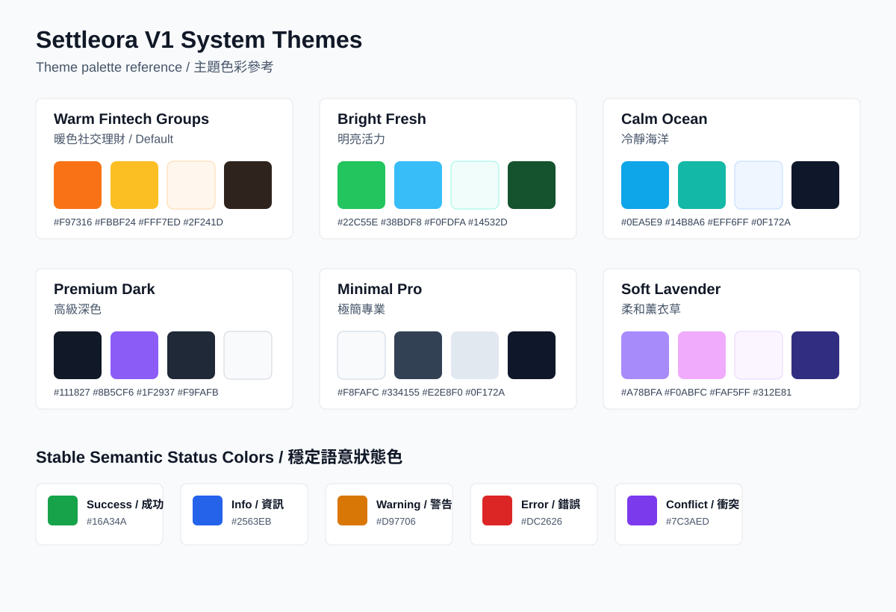

# Design System

## Purpose

This document defines Settleora's implementation-facing visual and interaction rules before UI implementation. It is intentionally implementation-agnostic: no CSS tokens, Flutter theme classes, design-token package, or generated client changes are added here.

## Default Style

Settleora's default style is **Warm Fintech Groups / 暖色社交理財**.

The default should feel:

- Warm and social enough for households, trips, couples, and friend groups.
- Clean and trustworthy enough for shared money.
- Polished and commercial-quality.
- Calm under financial disagreement, mismatch review, and settlement disputes.
- Practical for repeated daily use.

Orange is the default primary accent. It should be energetic without making warnings ambiguous.

## V1 System Themes

V1 includes all system themes:

- Warm Fintech Groups / 暖色社交理財 - default orange theme.
- Bright Fresh / 明亮活力.
- Calm Ocean / 冷靜海洋.
- Premium Dark / 高級深色.
- Minimal Pro / 極簡專業.
- Soft Lavender / 柔和薰衣草.

V1 allows choosing:

- System, light, or dark mode.
- A system-provided color theme.

Theme choice is a display preference. It does not affect authorization, policy, money calculations, or audit behavior.

## V2 Custom Semantic Colors

V2 / Day 2 may allow custom colors by semantic or action group, such as:

- Primary.
- Info.
- Success.
- Warning.
- Error.
- Conflict.

Semantic status colors must remain meaningfully stable. Customization must not make success, error, warning, conflict, or destructive states ambiguous. Future custom-color UI should warn or block combinations that fail contrast, color meaning, or accessibility requirements.

## Palette Sheet

See the static V1 palette reference:

## Color Tokens

These tokens are implementation-agnostic names for design direction. They are not code tokens yet.

| Hint | Token | English name | Traditional Chinese name | Use | Hex |
| --- | --- | --- | --- | --- | --- |
| 🟧 | warm.primary | Warm Orange | 暖橙 | Default primary action, active navigation, selected controls | `#F97316` |
| 🟨 | warm.secondary | Honey Gold | 蜂蜜金 | Friendly highlights, onboarding accents | `#FBBF24` |
| 🟫 | warm.surface | Warm Linen | 暖亞麻 | Default light app background | `#FFF7ED` |
| 🟤 | warm.text | Cocoa Ink | 可可墨 | Primary text on warm light surfaces | `#2F241D` |
| 🟢 | fresh.primary | Fresh Green | 清新綠 | Bright Fresh primary action | `#22C55E` |
| 🟦 | fresh.secondary | Sky Cyan | 天空青 | Bright Fresh supporting accents | `#38BDF8` |
| 🟦 | ocean.primary | Ocean Blue | 海洋藍 | Calm Ocean primary action | `#0EA5E9` |
| 🟩 | ocean.secondary | Seafoam | 海沫綠 | Calm Ocean supporting accents | `#14B8A6` |
| ⚫ | dark.background | Charcoal Night | 炭黑夜 | Premium Dark background | `#111827` |
| 🟣 | dark.primary | Electric Violet | 電光紫 | Premium Dark primary accent | `#8B5CF6` |
| ⚪ | pro.background | Paper White | 紙白 | Minimal Pro background | `#F8FAFC` |
| ⚫ | pro.primary | Graphite | 石墨黑 | Minimal Pro primary action/text accent | `#334155` |
| 🟣 | lavender.primary | Soft Lavender | 柔和薰衣草 | Soft Lavender primary accent | `#A78BFA` |
| 🩷 | lavender.secondary | Rose Mist | 玫瑰霧 | Soft Lavender supporting accent | `#F0ABFC` |
| 🟢 | semantic.success | Success Green | 成功綠 | Success, confirmed, synced, settled | `#16A34A` |
| 🔵 | semantic.info | Info Blue | 資訊藍 | Neutral info, help, processing | `#2563EB` |
| 🟡 | semantic.warning | Warning Amber | 警告琥珀 | Needs attention, due soon, partial issue | `#D97706` |
| 🔴 | semantic.error | Error Red | 錯誤紅 | Failed, rejected, invalid, destructive error | `#DC2626` |
| 🟣 | semantic.conflict | Conflict Purple | 衝突紫 | Sync conflict, mismatch requiring resolution | `#7C3AED` |
| ⚫ | neutral.text | Neutral Ink | 中性墨 | Default readable text | `#111827` |
| ⚪ | neutral.surface | Neutral Surface | 中性表面 | Cards, panels, forms | `#FFFFFF` |
| ⚪ | neutral.border | Soft Border | 柔和邊線 | Dividers, inputs, table lines | `#E5E7EB` |

Status colors should remain stable across themes. A success chip may be adapted for contrast, but it should still read as success rather than adopting the active theme color.

## Typography

Typography should be clear, friendly, and dense enough for financial data:

- Use a modern sans-serif system stack per platform unless a future brand typography task approves fonts.
- Avoid oversized marketing-style headings inside dashboards, cards, tables, forms, and admin screens.
- Use tabular numerals or equivalent alignment for money, balances, and reports where available.
- Keep labels concise and scannable.
- Support Traditional Chinese localization without layout breakage.
- Avoid using color alone to convey status.

## Spacing And Layout

Spacing should support repeated work:

- Use compact but breathable spacing for lists, tables, dashboards, and admin screens.
- Keep dashboard widgets aligned to stable responsive grids.
- Avoid nested card-on-card layouts.
- Use full-width page bands or unframed layouts for major sections.
- Keep dense operational admin content organized through tables, filters, segmented controls, and drawers rather than decorative panels.

## Radius And Shadow

Default cards and controls should be softly modern but not bubbly:

- Cards: 8px radius or less unless a platform system component requires otherwise.
- Inputs/buttons: consistent radius aligned with the chosen platform.
- Shadows: subtle, mostly for elevation, menus, popovers, dialogs, and floating action affordances.
- Avoid heavy glow effects or purely decorative background blobs.

## Button Hierarchy

Button hierarchy should be consistent:

- Primary: one main action per screen region.
- Secondary: safe alternative actions.
- Tertiary/ghost: navigation, low-emphasis actions.
- Destructive: archive, delete, revoke, cancel, disconnect, or policy-sensitive destructive actions.
- Icon buttons: common tools such as edit, reorder, resize, filter, search, refresh, scan, upload, download, and more.

Money-impacting and security-impacting actions should show consequence in labels, confirmation copy, or review screens.

## Widget Card Chrome

Widget cards should support quick scanning:

- Clear title.
- Optional context label, such as group name or surface.
- Freshness/sync state where relevant.
- Privacy-aware amount display.
- Empty, loading, unavailable, and permission-safe states.
- Direct route to source detail screen.
- Action buttons that revalidate authority at action time.

Widgets must not hide stale, failed, or conflict states behind cheerful summaries.

## Status Chips

Status chips should use stable semantic colors and plain language:

- Synced.
- Queued.
- Conflict.
- Failed.
- Draft.
- Pending review.
- Accepted.
- Rejected.
- Requested.
- Claimed paid.
- Confirmed.
- Disputed.
- Cancelled.
- Archived.

Chips should include icons or labels where color may be insufficient. Conflict and error states must remain visually distinct.

## Money Display Rules

Money display must be trustworthy:

- Always show amount with currency.
- Use locale-aware formatting.
- Align decimal places where comparing rows.
- Use clear signs for owed, paid, receives, credit, waived, and residual amounts.
- Distinguish actual confirmed values from estimates, forecasts, previews, and provisional OCR output.
- Distinguish bill-level FX snapshots from reference rates.
- Avoid showing rounded display values as if they were authoritative calculation precision.

In server mode, displayed authoritative money should come from API-accepted data. Client previews are allowed as previews only.

## Privacy Mode

Amount-hiding privacy mode should apply consistently to:

- Dashboard widgets.
- Lists and tables.
- Group overview.
- Reports.
- Notifications and action summaries.
- Recent activity.
- Mobile app switcher/screenshot-sensitive views where platform support allows.

Privacy mode should hide or blur values while retaining enough structure to navigate. It must not change permissions, calculations, sync behavior, audit behavior, or server validation.

## Loading, Error, And Empty States

Loading states should be calm and skeleton-friendly, especially for dashboards and lists.

Error states should:

- Use stable error/conflict semantics.
- Explain the next safe action.
- Preserve unsaved user input where possible.
- Avoid exposing secrets, tokens, storage paths, internal object keys, or sensitive backend details.

Empty states should be useful without becoming marketing pages:

- First bill: quick add or scan receipt.
- First group: create group or join invited group where implemented.
- No OCR reviews: scan/import or return to receipts.
- No settlements: explain that settled-up state is healthy.
- No reports: choose date range or create records.
- No admin failures: show healthy operational summary.

## Responsive UX

Responsive behavior should be surface-specific:

- Mobile: bottom navigation, sheet/drawer actions, one primary task at a time.
- Tablet: split panes where useful, especially review flows.
- User web: wider dashboards, resizable widgets, multi-pane group workspaces.
- Admin web: dense tables, filters, side navigation, persistent context.

Text must fit its parent controls at supported viewport sizes. Financial tables should adapt with pinned columns, row details, or stacked summaries rather than unreadable compression.

## Accessibility Rules

Future UI must support:

- Keyboard navigation for web.
- Screen reader labels for controls, status, and money.
- Visible focus states.
- Sufficient contrast in every theme.
- Touch targets suitable for mobile.
- Reduced motion preference.
- Error messages tied to form fields.
- Non-color status indicators.
- Localization-ready layouts, including Traditional Chinese text expansion.

Accessibility constraints apply to dashboards, drag/reorder controls, mismatch review, split editors, OCR review, admin tables, and destructive confirmations.
